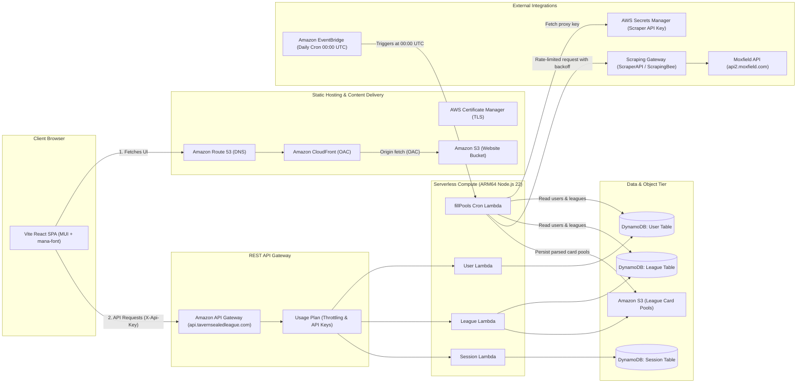

# Project Overview & Guidelines

This document provides project guidance, architecture overviews, development workflows, and standards for the Tavern Sealed League (`tsl-site`) application.

---

## 1. File Structure

This repository is structured as a multi-package full-stack project consisting of an AWS Cloud Development Kit (CDK) infrastructure backend, a React SPA frontend, and local configuration.

```text
.
├── .github/                   # GitHub configuration and automation workflows
├── backend/                   # AWS CDK infrastructure & Lambda backend
│   ├── bin/
│   │   └── app.ts             # CDK app entry point; initializes App and instantiates TslDotComStack
│   ├── lib/                   # Modular AWS CDK infrastructure constructs
│   │   ├── <aws-service>/     # Service construct helpers (api, dynamodb, events, lambda, s3, website)
│   │   └── stack.ts           # Root TslDotComStack composing all AWS service resources
│   ├── src/                   # Backend application source code
│   │   ├── jobs/              # Scheduled background jobs (e.g., card pool scrapers & sync tasks)
│   │   ├── resources/         # REST API Lambda handlers
│   │   ├── utils/             # Reusable AWS SDK, HTTP response, and helper utilities
│   │   └── types.ts           # Shared Zod schemas, data models, and Lambda environment shapes
│   ├── test/                  # Test suites for backend infrastructure and logic
│   ├── cdk.json               # AWS CDK toolkit configuration and execution flags
│   ├── cleanUp.ps1            # PowerShell script to clean compiled JS/d.ts files and test artifacts
│   ├── jest.config.js         # Jest test runner configuration using ts-jest
│   ├── package.json           # Backend dependencies, CDK commands, and test scripts
│   └── tsconfig.json          # TypeScript compiler options for the backend
├── frontend/                  # React Single-Page Application (SPA)
│   ├── public/                # Static public web assets
│   ├── src/                   # Frontend React application source code
│   │   ├── actions/           # API fetch client functions and browser storage helpers
│   │   ├── assets/            # Component images and static visual assets
│   │   ├── components/        # Reusable UI components
│   │   ├── pages/             # Route view pages
│   │   ├── App.tsx            # Main React application shell and route configuration
│   │   └── main.tsx           # React DOM client mount entry point
│   ├── index.html             # Application HTML shell entry point
│   ├── package.json           # Frontend dependencies and scripts
│   ├── tsconfig.json          # Frontend TypeScript compiler options
│   └── vite.config.ts         # Vite bundler and development proxy configuration
├── local-config/              # Local credentials and deployment variables (git-ignored)
│   └── index.ts               # AWS account ID, region, API keys, and localStorage storage keys
├── .gitignore                 # Files excluded from git tracking (node_modules, cdk.out, local-config)
├── GEMINI.md                  # Development guide, architecture overview, and project standards
└── README.md                  # Quickstart documentation and admin API usage instructions
```

### Architectural Conventions

- **Infrastructure Organization (`backend/lib/`)**: Group CDK constructs into dedicated subdirectories named after the AWS service or architectural role they provision (e.g., `api/`, `dynamodb/`, `events/`, `lambda/`, `s3/`, `website/`). Root assembly occurs in `backend/lib/stack.ts`.
- **Backend Application Logic (`backend/src/`)**:
  - RESTful resource CRUD handlers reside in `backend/src/resources/`.
  - Scheduled background execution jobs reside in `backend/src/jobs/`.
  - AWS SDK wrappers and HTTP response formatters reside in `backend/src/utils/`.
- **Frontend Code (`frontend/src/`)**: Component hierarchy is divided into reusable UI components in `frontend/src/components/`, routed views in `frontend/src/pages/`, and API interaction layer in `frontend/src/actions/`.
- **Shared Data Contracts (`backend/src/types.ts`)**: Central repository of Zod schemas and TypeScript types defining data models and Lambda runtime environment shapes.
- **Local Environment Isolation (`local-config/`)**: Contains account IDs, regions, and sensitive API keys. Kept strictly out of source control via `.gitignore`.
- **Entry Point (`backend/bin/app.ts`)**: Initializes `cdk.App`, loads configuration, and instantiates `TslDotComStack`.

---

## 2. High Level System Design

Serverless architecture optimized for high availability, automatic scaling, automated third-party card pool scraping, and low operational overhead.



### Core Components

- **Frontend (Presentation)**: Single-page application built with React 18, Vite, TypeScript, Material UI (MUI), and `mana-font` for native Magic: The Gathering mana symbol rendering. Compiled to static assets hosted in Amazon S3 and distributed via CloudFront.
- **Backend (API & Infrastructure)**: AWS CDK v2 TypeScript app provisioning Amazon API Gateway with custom regional domain mapping (`api.tavernsealedleague.com`) and usage plan rate limiting. Lambdas run on the ARM_64 architecture with Node.js 22 runtime.
- **Persistence (Data Tier)**:
  - **Amazon DynamoDB**: Three independent tables (`user`, `league`, `session`) managing user profiles, league states, and active sessions.
  - **Amazon S3**: Dedicated S3 bucket for serialized league card pool datasets, keeping heavy JSON payloads out of DynamoDB attribute limits.
- **Background Jobs (Card Pool Synchronization)**: Amazon EventBridge schedules a daily cron job triggering the `fillPools` Lambda. It fetches player decklists from Moxfield through a third-party scraping proxy (ScraperAPI or ScrapingBee) to bypass bot protection, employing exponential backoff on HTTP 429 and configurable inter-request delays.
- **Secrets Management**: AWS Secrets Manager stores scraping gateway credentials (`tsl/moxfield-gateway-api-key`), loaded at runtime by background worker tasks.

### Security & Access Control Architecture

- **API Key Authorization**: All REST endpoints enforce `apiKeyRequired: true` linked to an API Gateway Usage Plan. Dedicated API keys distinguish administrator operations from frontend application traffic, backed by monthly request quotas and burst/rate limits.
- **Origin Access Control (OAC)**: The website S3 bucket completely blocks public read access and permits access exclusively to Amazon CloudFront using SigV4 Origin Access Control (OAC).
- **TLS & Certificate Validation**: AWS Certificate Manager (ACM) manages automated DNS-validated TLS certificates for `tavernsealedleague.com`, `www.tavernsealedleague.com`, and `api.tavernsealedleague.com`. All HTTP requests redirect to HTTPS.
- **CORS Hardening**: API Gateway and Lambda response handlers enforce explicit `Access-Control-Allow-Origin` headers restricted to the application domain (`https://tavernsealedleague.com`).
- **Secret Separation**: API keys, proxy tokens, and AWS account configurations are kept in git-ignored local files (`local-config/`) or managed AWS Secrets Manager secrets.

---

## 3. Testing Protocols

All modifications must pass relevant test suites and compilation checks before being committed or deployed.

### Single-Purpose Unit & Infrastructure Tests (Jest)

- **Philosophy**: Tests validate CDK CloudFormation resource definitions, input/output contracts, and background job logic in isolation.
- **Location**: `backend/test/`
- **Scope**: Asserts resource counts for API Gateway methods, DynamoDB tables, Lambda functions, IAM roles/policies, and S3 buckets.
- **Command**:
  ```bash
  cd backend
  npm test
  ```

### Frontend Build Verification (TypeScript & Vite)

- **Philosophy**: Ensures type safety across all React components, API actions, and shared type contracts.
- **Location**: `frontend/`
- **Command**:
  ```bash
  cd frontend
  npm run build
  ```

### Change Verification Protocol

Before committing changes, execute both backend testing and frontend build checks:
```powershell
# From backend directory
npm test

# From frontend directory
npm run build
```

### Cleanup Utility

To purge compiled JavaScript (`.js`), type definition files (`.d.ts`), test coverage, and CDK synthesis output from the backend workspace:
```powershell
cd backend
npm run cleanup
```

---

## 4. Version Control Etiquette

Always ask the user for explicit confirmation before committing or pushing anything. Never commit or push autonomously.

### Commit Message Structure

Every commit requires a concise summary subject line followed by a blank line and a detailed bulleted body:

1. **Subject Line**: Concise summary in the imperative mood (e.g., `Fix split card mana cost rendering and update dependencies`). Limit to ~50–72 characters.
2. **Commit Body**: Explains context/rationale when applicable, followed by explicit bullet points detailing each discrete change.

### Example Commit Format

```text
Restore Moxfield sync with scraping gateway, rate limiting, and dedicated app API key

- Route Moxfield decklist requests through scraping gateway with Secrets Manager integration to bypass Cloudflare bot protection
- Add sequential request staggering and retry backoff on HTTP 429 in fillPools to respect gateway concurrency limits
- Increase fillPools Lambda timeout to 5 minutes to accommodate sequential scraping intervals
- Configure dedicated frontend application API key alongside personal admin key
- Use absolute asset entry paths and jest-autoclean to resolve esbuild bundling issues
```

### Commit Hygiene

- **Atomic Commits**: Scope each commit to a single logical feature, fix, or refactor.
- **Clean Diffs**: Exclude extraneous whitespace, temporary debug logs, build outputs (`dist/`, `cdk.out/`), and compiled artifacts.
- **Pre-Commit Verification**: Run `npm test` in `backend/` and `npm run build` in `frontend/` before requesting commit approval.
- **User Approval**: Always ask the user for explicit confirmation before committing or pushing anything.

---

## 5. Coding Style

### Alphabetical Ordering

Ensure arrays, object elements, and imports follow alphabetical order:

- **Arrays**: Order literal array elements alphabetically where ordering is non-semantic.
- **Imports**: Order import statements alphabetically by module path, and order named imports within braces alphabetically.
- **Object Elements**: Order object properties, type attributes, and interface declarations in alphabetical order.

### Schema-First Validation (Zod)

- All external API request bodies and query parameters must be validated using Zod schemas defined in `backend/src/types.ts`.
- Runtime environment variables consumed by Lambda functions must be validated using corresponding Zod environment schemas (e.g., `ResourceLambdaEnvSchema`, `FillPoolsLambdaEnvSchema`).
- Frontend API consumption should leverage shared backend types to ensure full contract alignment across client and server.
